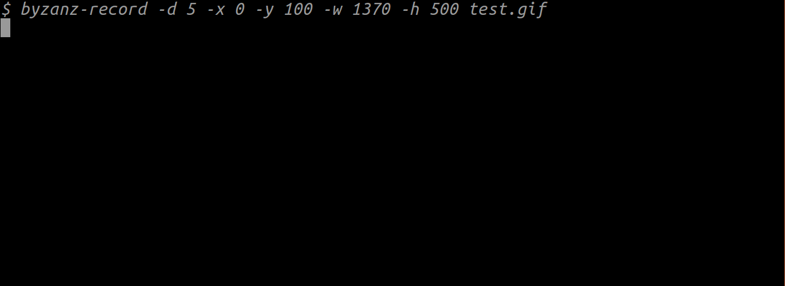
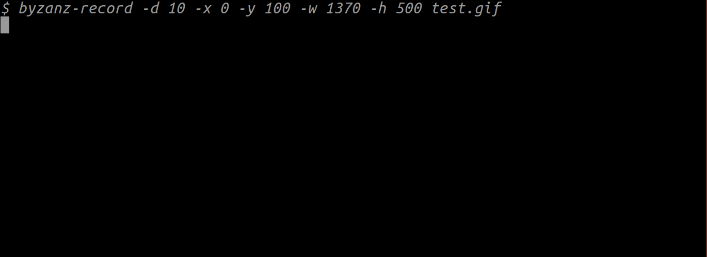

# This is how it looks

### the basic
```shell
clock
```


### slide
```shell
clock slide
```


### change color
```shell
clock yellow
clock blue
clock red
```


### you can combine the functions
```shell
clock red slide
```


